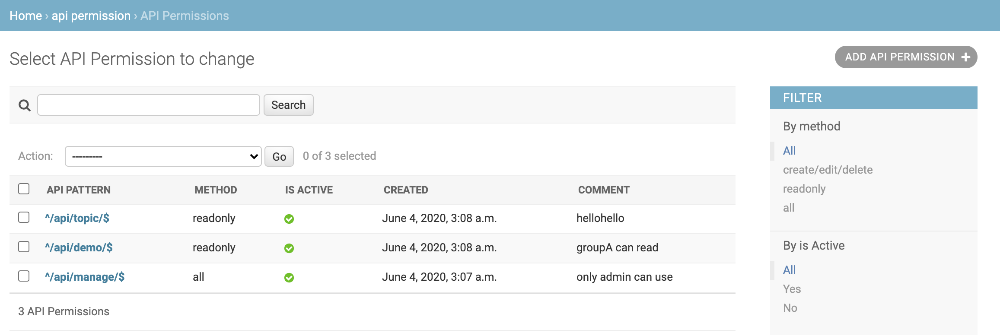

# Django-API-Permission


## 1. Intro

A Django api permission manager that helps you custom api url in regular expression and control access.

## 2. Quick Start

### 2.1 Install

```
pip install django-api-permission
```

### 2.2 add to INSTALLED_APPS and MIDDLEWARE

```
INSTALLED_APPS = [
    ...
    'api_permission',
    ...
]

MIDDLEWARE = [
    'django.contrib.sessions.middleware.SessionMiddleware',
    'django.contrib.auth.middleware.AuthenticationMiddleware',
    ...
    'api_permission.middleware.APIPermCheckMiddleware',
]
```

### 2.3 migrate

```
./manage.py migrate api_permission
```

### 2.4 API_PREFIX

You can custom `API_PREFIX` in settings.py to only check the API starts with API_PREFIX, default is `/api/`.

## 3. Demo

### 3.1 list



### 3.2 edit


### 3.3 result


